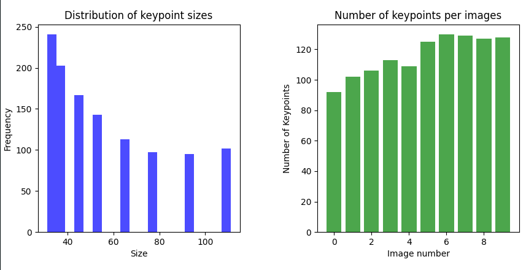

# SFND 2D Feature Tracking


The idea of the camera course is to build a collision detection system - that's the overall goal for the Final Project. As a preparation for this, you will now build the feature tracking part and test various detector / descriptor combinations to see which ones perform best. This mid-term project consists of four parts:

* First, you will focus on loading images, setting up data structures and putting everything into a ring buffer to optimize memory load. 
* Then, you will integrate several keypoint detectors such as HARRIS, FAST, BRISK and SIFT and compare them with regard to number of keypoints and speed. 
* In the next part, you will then focus on descriptor extraction and matching using brute force and also the FLANN approach we discussed in the previous lesson. 
* In the last part, once the code framework is complete, you will test the various algorithms in different combinations and compare them with regard to some performance measures. 

See the classroom instruction and code comments for more details on each of these parts. Once you are finished with this project, the keypoint matching part will be set up and you can proceed to the next lesson, where the focus is on integrating Lidar points and on object detection using deep-learning. 

## Dependencies for Running Locally
1. cmake >= 2.8
 * All OSes: [click here for installation instructions](https://cmake.org/install/)

2. make >= 4.1 (Linux, Mac), 3.81 (Windows)
 * Linux: make is installed by default on most Linux distros
 * Mac: [install Xcode command line tools to get make](https://developer.apple.com/xcode/features/)
 * Windows: [Click here for installation instructions](http://gnuwin32.sourceforge.net/packages/make.htm)

3. OpenCV >= 4.1
 * All OSes: refer to the [official instructions](https://docs.opencv.org/master/df/d65/tutorial_table_of_content_introduction.html)
 * This must be compiled from source using the `-D OPENCV_ENABLE_NONFREE=ON` cmake flag for testing the SIFT and SURF detectors. If using [homebrew](https://brew.sh/): `$> brew install --build-from-source opencv` will install required dependencies and compile opencv with the `opencv_contrib` module by default (no need to set `-DOPENCV_ENABLE_NONFREE=ON` manually). 
 * The OpenCV 4.1.0 source code can be found [here](https://github.com/opencv/opencv/tree/4.1.0)

4. gcc/g++ >= 5.4
  * Linux: gcc / g++ is installed by default on most Linux distros
  * Mac: same deal as make - [install Xcode command line tools](https://developer.apple.com/xcode/features/)
  * Windows: recommend using either [MinGW-w64](http://mingw-w64.org/doku.php/start) or [Microsoft's VCPKG, a C++ package manager](https://docs.microsoft.com/en-us/cpp/build/install-vcpkg?view=msvc-160&tabs=windows). VCPKG maintains its own binary distributions of OpenCV and many other packages. To see what packages are available, type `vcpkg search` at the command prompt. For example, once you've _VCPKG_ installed, you can install _OpenCV 4.1_ with the command:
```bash
c:\vcpkg> vcpkg install opencv4[nonfree,contrib]:x64-windows
```
Then, add *C:\vcpkg\installed\x64-windows\bin* and *C:\vcpkg\installed\x64-windows\debug\bin* to your user's _PATH_ variable. Also, set the _CMake Toolchain File_ to *c:\vcpkg\scripts\buildsystems\vcpkg.cmake*.


## Basic Build Instructions

1. Clone this repo.
2. Build Docker container `docker build . -t feature_tracking`
3. Allow local connections to your X server `xhost +local:`
4. Run the docker container and forward display `docker run -it -e DISPLAY=$DISPLAY -v /tmp/.X11-unix:/tmp/.X11-unix -v $(pwd):/app feature_tracking`
5. (From the container) Make a build directory in the top level directory: `mkdir build && cd build`
6. (From the container) Compile: `cmake .. && make`
7. (From the container) Run it: `./2D_feature_tracking`.


## Task 7 

Compiling using thw CMake file generates a executable `./task7` running it counts the number of keypoints on the preceding vehicle for all 10 images and all the detectors. It generates one `.dat` file for each detector in `output/task7/`. To visualize the results we provide a script `plot.py`. To run it you must install the dependencies first: from `output/task7/` run `python -m venv venv && source venv/bin/activate && pip install -r requirements.txt`. Then run `python plot.py FILE.dat`. For example here is the result obtained with `orb.dat`: 




## Task 8

The number of matched keypoints for all 10 images using all possible combinations of detectors and descriptors. In the matching step, the BF approach is used with the descriptor distance ratio set to 0.8. 

| Detector | AKAZE | BRIEF | BRISK | FREAK | ORB | SIFT |
|---|---|---|---|---|---|---|
| sift | n/a | 1250 | 1249 | 1240 | Out of Memory Error | 1250 |
| brisk | n/a | 2508 | 2508 | 2326 | 2508 | 2508 |
| fast | n/a  | 3693 | 3693 | 3693 | 3693 | 3693 |
| harris | n/a | 214 | 214 | 214 | 214 | 214 |
| shitomasi | n/a | 1067 | 1067 | 1067 | 1067 | 1067 |
| orb |n/a  | 1033 | 950 | 549 | 1033 | 1033 |
| akaze | 1491 | 1491 | 1491 | 1491 | 1491 | 1491 |
